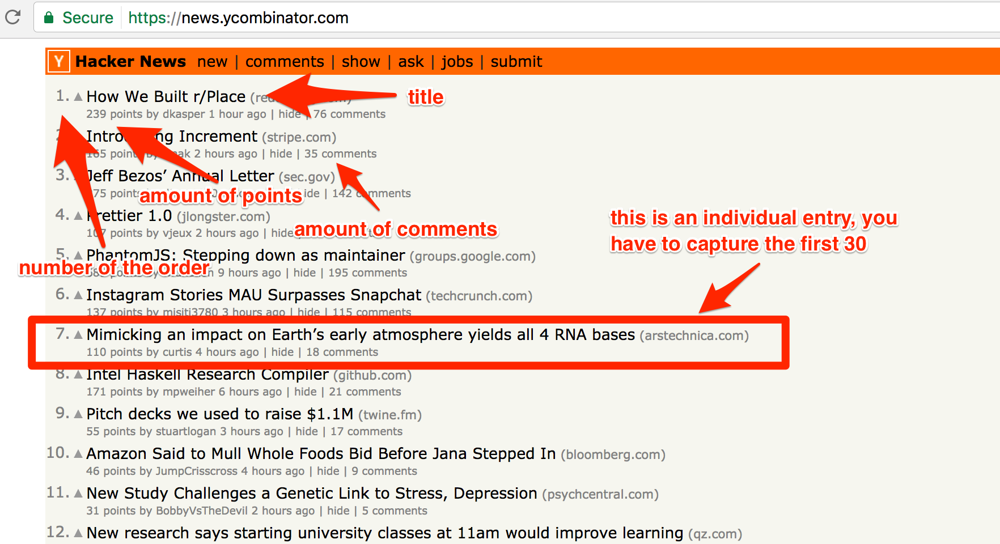
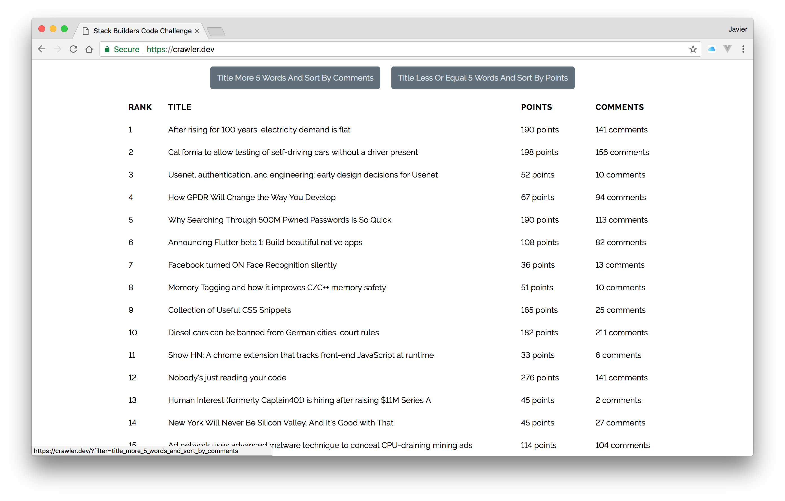

## Stack Builders Code Challenge ##

#### The Challenge ####
Create a web crawler using scraping techniques to extract the first 30 entries from https://news.ycombinator.com/. You'll only care about the title, number of the order, the amount of comments and points for each entry.



From there, it should be able to perform a couple of filtering operations:

* Filter all previous entries with more than five words in the title ordered by amount of comments first.
* Filter all previous entries with less than or equal to five words in the title ordered by points.

#### The Solution ####
The solution is made with [Laravel](https://laravel.com/) latest version. In order to scrape the given site, I added a laravel package through [Composer](https://getcomposer.org/). You can find this package in https://github.com/dweidner/laravel-goutte. This package is only a wrapper for [Goutte](https://github.com/FriendsOfPHP/Goutte), so you can use every functionality available.

After installing the Goutte wrapper the process is pretty straightfordward, so the whole solution is contained in the default route callback.

The first thing to do is pass the request object to the route and initialize an empty collection with helper ```collect()```, so I can save the scrapping results in there.
```php
Route::get('/', function (Request $request) {
    $collection = collect([]);
});
```
Then I initialize the crawler and filter the DOM for the required data, so I can store it in the collection. To loop through every entry I used the ```each()``` method and pass the empty collection I initialized before so I can use it inside the callback. I will collect every entry data and push it to the collection.
```php
$crawler = Goutte::request('GET', 'https://news.ycombinator.com/');
$crawler->filter('.athing')->each(function ($node) use ($collection) {
    $collect->push(collect([
        // Here will be stored the key value pairs
    ]))
});
```
If you inspect the html structure in the [hacker news site](https://news.ycombinator.com), you will notice that every entry is wrapped in a tr tag with the class **athing**. Inside you can find the rank and title, with the classes **rank** and **storylink** respectively. After the **athing** of every entry, the next tr tag contains some information about the entry. To get the points of the entry, you can find it with the class **score**. To get the comments is a little bit trickier, because the comments have no specific class or either href attribute. So I looked for the second a tag with href attribute that starts with **item** (The first is the time it was posted). So the collection of entries will be built like this:
```php
$collection->push(collect([
    'title' => $node->filter('.storylink')->text(),
    'rank' => (int) $node->filter('.rank')->text(),
    'points' => (int) $node->nextAll()->filter('.score')->text(),
    'comments' => (int) $node->nextAll()->filter('a[href^="item"]')->eq(1)->text()
]));
```
Once I have the entries in the collection, if the request query variable filter match any of the two options available, I will filter the collection. The available values for the filter are **title_more_5_words_and_sort_by_comments** and **title_less_or_equal_5_words_and_sort_by_points**.
To get all the entries with the title with more than 5 words and sorted by comments, the validation code is like this:
```php
if ($request->filter === 'title_more_5_words_and_sort_by_comments') {
    $collection = $collection->filter(function ($item) {
        return str_word_count($item->get('title')) > 5;
    })->sortByDesc('comments');
};
```
To get all the entries with the title with less or equal to 5 and sorted by points, the validation code is like this:
```php
if ($request->filter === 'title_less_or_equal_5_words_and_sort_by_points') {
    $collection = $collection->filter(function ($item) {
        return str_word_count($item->get('title')) <= 5;
    })->sortByDesc('points');
};
```
And finally I just return the view with the collection.
```php
return view('welcome', ['entries' => $collection]);
```
